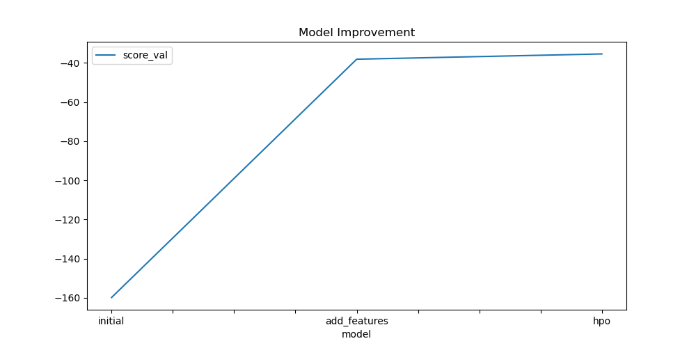

# Report: Predict Bike Sharing Demand with AutoGluon Solution
#### Samuel Alexander Rodriguez

## Initial Training
### What did you realize when you tried to submit your predictions? What changes were needed to the output of the predictor to submit your results?
There were no changes needed since I set the negative outputs to 0 in post-processing to prevent the error for negative results. 

### What was the top ranked model that performed?
The top ranked model was the hpo model with a WeightedEnsemble_L3 model. 

## Exploratory data analysis and feature creation
### What did the exploratory analysis find and how did you add additional features?
In the exploratory analysis, I found that hour had a stronger correlation than temp and atemp. And although temp and atemp were highly correlated, I decided to keep just temp since they were highly multicollinear. 

### How much better did your model preform after adding additional features and why do you think that is?
The model performed 0.83427 better after adding the additional features. The model was able to learn more about the data and make better predictions. Given that the hour was the most important feature, it makes sense that the model would perform better with the additional features.

## Hyper parameter tuning
### How much better did your model preform after trying different hyper parameters?
After trying different hyperparameters, the model performed 0.03906 better. The model was able to learn more about the data and make better predictions.

### If you were given more time with this dataset, where do you think you would spend more time?
If I were given more time with this dataset, I would spend more time on feature engineering. I would try to create more features that could help the model learn more about the data and make better predictions. And I would also spend more time on hyperparameter tuning to see if I could get a better score. I feel the score could be improved with more time.

### Create a table with the models you ran, the hyperparameters modified, and the kaggle score.
|model|hpo1|hpo2|hpo3|score|
|--|--|--|--|--|
|initial|None|None|None|1.34972|
|add_features|None|None|None|0.51545|
|hpo|NN_TORCH|GBM|XGB|0.47639|

```python
hyperparameters = {
    'NN_TORCH': {'num_epochs': 10, 'activation': 'relu', 'dropout_prob': space.Real(0.0, 0.1, 0.5)},
    'GBM': {'num_boost_round': 1000, 'learning_rate': space.Real(0.01, 0.1, 0.5, log=True)},
    'XGB': {'n_estimators': 1000, 'learning_rate': space.Real(0.01, 0.1, 0.5, log=True)}
}
```

### Create a line plot showing the top model score for the three (or more) training runs during the project.



### Create a line plot showing the top kaggle score for the three (or more) prediction submissions during the project.


## Summary
In summary the model was able to learn more about the data and make better predictions after adding additional features and trying different hyperparameters. The model was able to learn more about the data and make better predictions. Given that the hour was the most important feature, it makes sense that the model would perform better with the additional features. The score could be improved with more time.

At the end of the project, the model was able to predict bike sharing demand with an kaggle score of 0.47639 even though I have the hyper paremter tunning timed to 1 second, preventing each hyperparementer iteration from running fully. Longer hyperparameter tuning would have improved the score even further.
