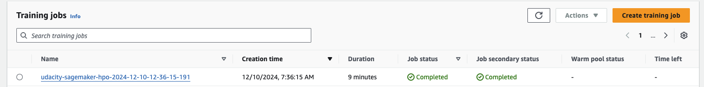
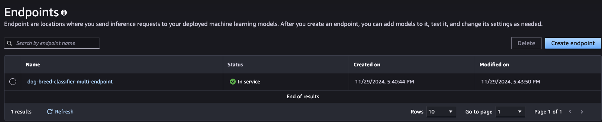
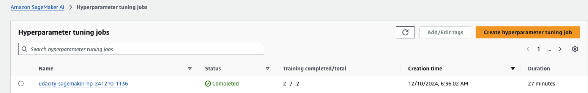
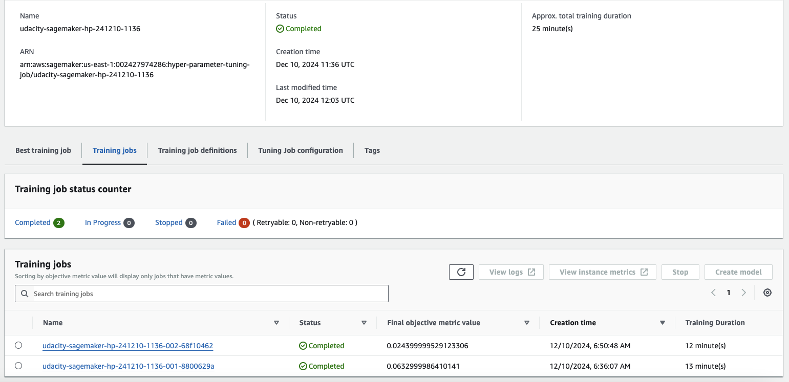
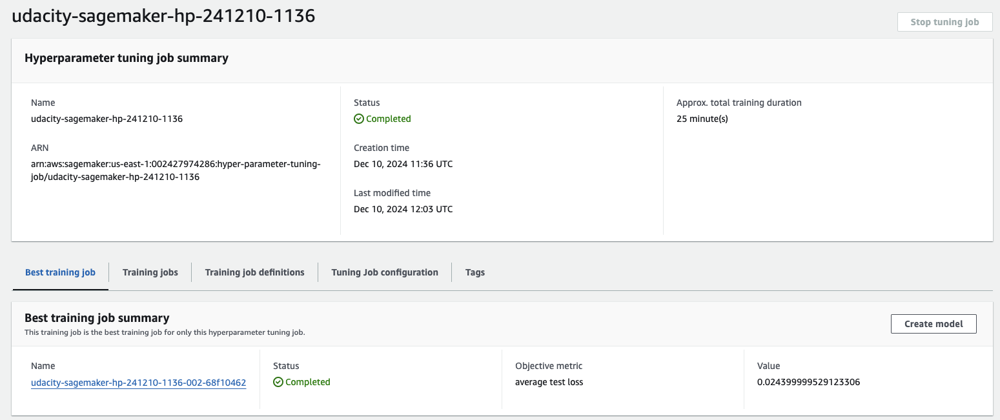

# Multi-class Multi-Model Dog Breed Classification

This project is designed to train a multi-class multi-model image classification model using the dog breed classification dataset. The project uses the AWS SageMaker service to train the model and deploy it as an endpoint. The project also uses the SageMaker Debugger and Profiler to profile and debug the model during training. AWS Clarify is used to explain the model's predictions. It is designed to be a starting point for building a more complex image classification model using AWS SageMaker. Therefore accuracy is not the main goal of this project.

## Project Set Up and Installation
Enter AWS through the gateway in the course and open SageMaker Studio. 
- Download the starter files.
- Download/Make the dataset available. 

> The following notebook is designed to be run in SageMaker Studio. It is recommended to run the notebook in SageMaker Studio to avoid any compatibility issues: [train_and_deploy.ipynb](train_and_deploy.ipynb)

## Dataset
The provided dataset is the dogbreed classification dataset which can be found in the classroom. The dataset contains images of 133 different dog breeds. The dataset is divided into training, validation, and test sets. The dataset is structured as follows:

```
- dogImages
  - train
    - 001.Affenpinscher
    - 002.Afghan_hound
    - ...
  - test
    - 001.Affenpinscher
    - 002.Afghan_hound
    - ...
  - valid
    - 001.Affenpinscher
    - 002.Afghan_hound
    - ...
```

### Access
Upload the data to an S3 bucket through the AWS Gateway so that SageMaker has access to the data. You can download it locally and then upload it to S3. Or you can use wget to download the data directly to the SageMaker instance and use boto3 to upload it to S3. The code is included in the notebook.

## Hyperparameter Tuning
What kind of model did you choose for this experiment and why? Give an overview of the types of parameters and their ranges used for the hyperparameter search

The model used for this experiment is a pretrained ResNet18 model. The model is trained using transfer learning. This model was chosen because it is a good starting point for image classification tasks. The model is pretrained on the ImageNet dataset and can be fine-tuned on the dog breed classification dataset.


## Debugging and Profiling
During the final testing of the model, the model was profiled and debugged to ensure that it was working as expected. 

This was the final testing job run:


The testing captured profiling and debugging information for the first 50 steps of the training job on a 5000ms interval capturing the following information:
- System metrics
- Framework metrics
- Detailed profiling information

### Results
**TODO**: What are the results/insights did you get by profiling/debugging your model?

The profiling and debugging information showed that the model was working as expected and that the training job was running smoothly.

However, there were several factors to consider:
- The CPU utilization was very low, which could indicate that the model was not complex enough to require a lot of resources. Ideally, we would want to use GPU instances for training the model.

- The initialization took a long time due to s3 data transfer to disk. Perhaps using boto3 to download the data is not the most efficient way to get the data. Using aws cli to download the data to the instance might be a better option. For example:

  
  ```
  aws s3 cp s3://my-bucket/dataset /local/data --recursive --only-show-errors --no-progress --multipart-chunk-size 8MB
  ```
  or 
  ```
  aws s3 cp --endpoint-url https://s3-accelerate.amazonaws.com s3://my-bucket/dataset /local/data
  ```

  - GPU was not set up for the training job due to cost implications. This could have sped up the training process significantly. This would optimize the heavy convolutional operations in the model.

  - There was more time allocated to evaluating the model rather than training it. This could be adjusted to allocate more time to training the model by reducing the frequency of evaluation.

See the [profiler report](ProfilerReport/profiler-output/profiler-report.html) for more information.

## Model Deployment

The first model is a ResNet18 model that is pretrained on the ImageNet dataset. The model is fine-tuned on the dog breed classification dataset. The model is first registered with the model registry and then deployed as an endpoint using the SageMaker SDK. The model is stored in an S3 bucket and the code used to deploy the model is in the notebook.

The second model is a mobilenetv2 model that is optimized for mobile devices. This model is also registered with the model registry and deployed as an endpoint using the SageMaker SDK.

 The Multi-Model code used to create the endpoint is in the notebook.

The models can be queried using the following code:

```python
import json

runtime_client = boto3.client("sagemaker-runtime")

endpoint_name = "dog-breed-classifier-multi-endpoint"
image_path = "dogImages/test/001.Affenpinscher/Affenpinscher_00003.jpg"

# Load the image as bytes
with open(image_path, "rb") as f:
    payload = f.read()

# Invoke the endpoint for core model
response = runtime_client.invoke_endpoint(
    EndpointName=endpoint_name,
    TargetModel="dog-breed-classifier/model.tar.gz",
    ContentType="application/x-image",
    Body=payload,
)

# Decode the response
result = response["Body"].read()
print("Prediction result:", json.loads(result))

# Invoke the endpoint for mobile model
response = runtime_client.invoke_endpoint(
    EndpointName=endpoint_name,
    TargetModel="dog-breed-classifier-mobile/model.tar.gz",
    ContentType="application/x-image",
    Body=payload,
)

# Decode the response
result = response["Body"].read()
print("Prediction result:", json.loads(result))
```


Here is a screenshot of the deployed active endpoint in Sagemaker.


Here are the screenshots of the hyperparameter tuning job that shows at least 2 different training runs and their results.





## Standout Suggestions

### ECR Image hpo.py deployment
The hpo.py script is deployed as an ECR image. The script is used to run the hyperparameter tuning job. The script is stored in an ECR repository and can be used to run the hyperparameter tuning job. The code used to deploy the ECR image is in the notebook. The ERC image includes the smddebug hook to capture the profiling and debugging information. Therefore the hpo.py and train_model.py scrips were implemented within the same ECR image. 

### Multi-Model Endpoint
The model is deployed as a multi-model endpoint. The multi-model endpoint is used to deploy multiple models as a single endpoint. The code used to create the multi-model endpoint is in the notebook. The multi-model endpoint is used to deploy the ResNet18 and MobileNetV2 models as a single endpoint. The models can be queried using the code provided above.

### Batch Transform
The ResNet18 model was used to run a batch transform job on the validation dataset only to conserve resources. However, the validation dataset will give us an idea of how well or how inbalanced the model is. The code used to run the batch transform job is in the notebook.

### Model Explainability
The model explainability using AWS Clarify was implemented using the results of the batch transform job. The code used to run the model explainability job is in the notebook. And the report is located here: [Clarify Report](clarify-report.html). 

The ClassBalanceCount variance was expected to be small. However, the report shows high levels of inbalance. This indicates that we must either reduce the number of classes or increase the number of samples per class to improve the model's performance. We could also use model training techniques such as stratified sampling to improve the model's performance in which each subset of the data contains approximately the same distribution of the target variable as the original dataset during training and validation.

The report shows high levels of class inbalance and missclassification. This is expected as the model was not trained for accuracy but rather to demonstrate the use of AWS SageMaker services.