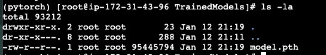

## Student justifies the type of Sagemaker instance they created
    Text in the writeup describes and justifies the student's choice
> Since the heavy computing (training, batching, and inference) will be conducted using the Estimator, which will handle the creation of new instances, the instance selected was a small one: ml.t3.medium. This will minimize the cost of implementation.

## Create and open an EC2 instance
    Writeup contains a description of the EC2 instance created, including justification for the chosen type

> The EC2 instance selected was a m5.large. This instance was selected because it is a general-purpose instance that provides a balance of compute, memory, and networking resources. Since there is no much data to train on GPU, the m5.large instance was selected to minimize the cost of implementation. And compared to a t5 instance, the m5 instance provides better performance.

Here is the screenshot of the model saved in the EC2 instance:


## Student identified potential vulnerabilities in the project's IAM configuration.
    The writeup contains a description of potential vulnerabilities in the IAM setup, including the following: roles that have "FullAccess" policies attached, roles that are old or inactive, and roles with policies for functions that the project is no longer using.
> The IAM role created for the Lambda function, IAM Role `LambdaFunctionUdacity5-role-m9k4xfwe`, has the `AmazonSageMakerFullAccess` policy attached. This policy provides full access to all SageMaker resources. This is a vulnerability because the Lambda function only needs read access to the SageMaker endpoint. The policy should be updated to provide only the necessary permissions. A bad actor could potentially use the Lambda function to delete SageMaker resources or create new ones, which could result in financial loss or data leakage. 

> Roles that are old or inactive can also be a vulnerability. If a role is no longer in use, it should be deleted to prevent unauthorized access to resources. Bad actors could potentially use old or inactive roles to gain access to resources that they should not have access to.

> Roles for functions that the project is no longer using can also be a vulnerability. If a role is no longer in use, the policies attached to that role should be reviewed and removed if they are no longer needed. Bad actors could potentially use these policies to gain unauthorized access to resources.


## Student clearly describes the configuration of concurrency (on the Lambda function) and auto-scaling (for the deployed endpoint)
    The writeup clearly describes traffic, cost, and efficiency considerations for both concurrency and auto-scaling.

> A Lambda function has a concurrency limit of 1000. This means that the function could handle up to 1000 requests at the same time. Reserve concurrency can be set from 1 to 1000. Increasing the reserve concurrency will reduce the latency of the function, but it will also increase the cost. Any request that exceeds the reserve concurrency will be throttled. This follows the serverless architecture principle of "cold start" where the function is initialized when a request is received. The Lambda function will scale automatically based on the number of requests received. This will help to optimize the cost and efficiency of the function.

> There is also the option to set up provisioned concurrency for the Lambda function. Provisioned concurrency will keep the function warm and ready to handle requests. This will reduce the latency of the function, but it will also increase the cost since the function will be running even when there are no requests. Provisioned concurrency can be set up to the reserve concurrency limit. This is not fully serverless since the function will be running all the time, but it can be useful for applications that require low latency.

## Test the Lambda function by invoking the endpoint with the "lab.jpg" input.

    Student provides the Lambda function response in the writeup

> I could not find the lab.jpg image but I used the Carolina-Dog-standing-outdoors.jpg image instead.

    Here is the output of the Lambda function:

```
    Status: Succeeded
    Test Event Name: ImageTest
    
    Response:
    {
      "statusCode": 200,
      "headers": {
        "Content-Type": "text/plain",
        "Access-Control-Allow-Origin": "*"
      },
      "type-result": "<class 'str'>",
      "Content-Type-In": "LambdaContext([aws_request_id=07f7761d-3fb2-41f0-a790-9debc31f308b,log_group_name=/aws/lambda/LambdaFunctionUdacity5,log_stream_name=2025/01/12/[$LATEST]1875707e4a6e4d1aa22c0dd5b2057551,function_name=LambdaFunctionUdacity5,memory_limit_in_mb=128,function_version=$LATEST,invoked_function_arn=arn:aws:lambda:us-east-1:477684614357:function:LambdaFunctionUdacity5,client_context=None,identity=CognitoIdentity([cognito_identity_id=None,cognito_identity_pool_id=None])])",
      "body": "[[-8.520931243896484, -5.1566548347473145, -2.4621925354003906, -0.5813032388687134, -3.301137685775757, -5.3489837646484375, -2.022136926651001, -1.804017424583435, -7.51177453994751, -1.8523025512695312, -0.5517253875732422, -3.9753341674804688, -2.1999154090881348, 0.7461155652999878, -3.322800874710083, -1.985258936882019, -9.118149757385254, -1.15774667263031, -5.609383583068848, 1.3356945514678955, -4.8936591148376465, -2.5770814418792725, -7.1848649978637695, -7.394983768463135, -2.369947671890259, -10.407410621643066, -2.1238667964935303, -4.073144435882568, -5.093541145324707, -3.1769847869873047, -2.2923221588134766, -3.7757492065429688, -7.37149715423584, -1.1321039199829102, -9.199128150939941, -7.643091678619385, -2.3612747192382812, -2.6706624031066895, -2.365560531616211, -4.1386260986328125, -2.210994005203247, -3.0483503341674805, -1.3530516624450684, -4.457169532775879, -2.174729585647583, -7.752691268920898, -3.237989664077759, -1.5437806844711304, -3.4406659603118896, -3.7129015922546387, -2.4566633701324463, -5.416479110717773, -5.602957248687744, -3.8491735458374023, -7.169597148895264, -1.8013380765914917, -4.719341278076172, -5.57226037979126, -1.2979151010513306, -2.237948417663574, -6.200550079345703, -4.484364032745361, -6.677281379699707, -5.4189958572387695, -2.516430139541626, -6.526220321655273, -0.2924160957336426, -4.627242088317871, -2.176565408706665, -0.4771789014339447, -1.0933576822280884, -6.149726390838623, -4.8273725509643555, -5.303669452667236, -7.714245796203613, -2.510530710220337, -6.846775054931641, -2.9529213905334473, -5.062537670135498, -4.206657886505127, -0.8212065100669861, -8.93677806854248, 0.3781607747077942, -1.7340582609176636, -5.862433433532715, -3.631775379180908, -1.9346163272857666, -7.344891548156738, -2.8941588401794434, -1.980580449104309, -5.378170967102051, -5.571441173553467, -5.813339710235596, -5.569592475891113, -5.432295799255371, -3.0080840587615967, -3.9393677711486816, -3.9448208808898926, -6.7718586921691895, -5.739477157592773, -7.239410877227783, -2.9044368267059326, -3.9039342403411865, -5.368179798126221, -5.6350250244140625, -9.76732349395752, -2.2608988285064697, -2.414905548095703, -2.964263677597046, -0.8541459441184998, -2.2836647033691406, -0.9559986591339111, -7.74803352355957, -5.427750587463379, -7.207777976989746, -0.9844404458999634, -6.5185546875, -0.6504486203193665, -6.016781330108643, 0.4066259264945984, -2.7273237705230713, -2.7069344520568848, -3.552933692932129, -4.9362077713012695, -9.507065773010254, -2.8786189556121826, -3.9433388710021973, -1.087854266166687, -5.045780181884766, -4.580044269561768, -7.846080780029297, -2.1105544567108154, -2.9147634506225586]]"
    }
    
    Function Logs:
    Loading Lambda function
    START RequestId: 07f7761d-3fb2-41f0-a790-9debc31f308b Version: $LATEST
    Context::: LambdaContext([aws_request_id=07f7761d-3fb2-41f0-a790-9debc31f308b,log_group_name=/aws/lambda/LambdaFunctionUdacity5,log_stream_name=2025/01/12/[$LATEST]1875707e4a6e4d1aa22c0dd5b2057551,function_name=LambdaFunctionUdacity5,memory_limit_in_mb=128,function_version=$LATEST,invoked_function_arn=arn:aws:lambda:us-east-1:477684614357:function:LambdaFunctionUdacity5,client_context=None,identity=CognitoIdentity([cognito_identity_id=None,cognito_identity_pool_id=None])])
    EventType:: <class 'dict'>
    Event {'url': 'https://s3.amazonaws.com/cdn-origin-etr.akc.org/wp-content/uploads/2017/11/20113314/Carolina-Dog-standing-outdoors.jpg'}
    END RequestId: 07f7761d-3fb2-41f0-a790-9debc31f308b
    REPORT RequestId: 07f7761d-3fb2-41f0-a790-9debc31f308b	Duration: 2074.91 ms	Billed Duration: 2075 ms	Memory Size: 128 MB	Max Memory Used: 82 MB	Init Duration: 451.03 ms
    
    Request ID: 07f7761d-3fb2-41f0-a790-9debc31f308b
```


